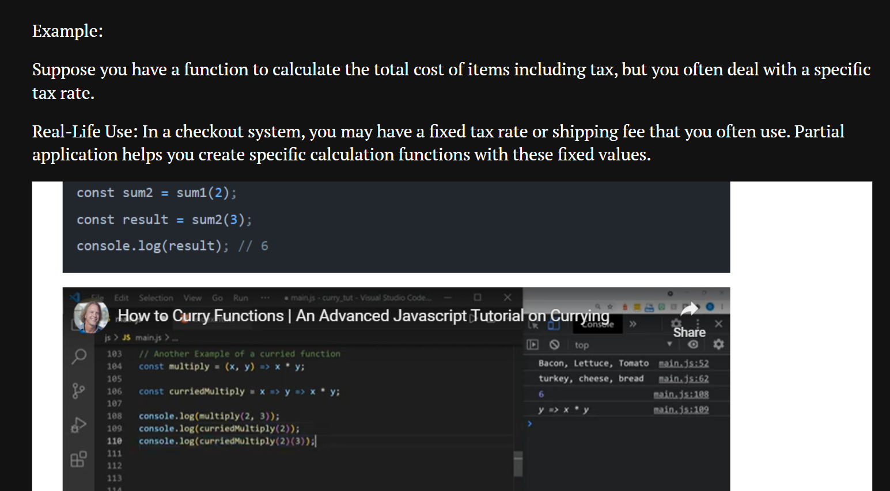

---
# You can also start simply with 'default'
theme: seriph
# random image from a curated Unsplash collection by Anthony
# like them? see https://unsplash.com/collections/94734566/slidev
background: https://cover.sli.dev
# some information about your slides (markdown enabled)
title: Welcome to Slidev
info: |
  ## Slidev Starter Template
  Presentation slides for developers.

  Learn more at [Sli.dev](https://sli.dev)
# apply unocss classes to the current slide
class: text-center
# https://sli.dev/custom/highlighters.html
highlighter: shiki
# https://sli.dev/guide/drawing
drawings:
  persist: false
# slide transition: https://sli.dev/guide/animations#slide-transitions
transition: slide-left
# enable MDC Syntax: https://sli.dev/guide/syntax#mdc-syntax
mdc: true
---

# this. Keyword

---

# Simple Definition

###

The `this` keyword refers to the context where a piece of code supposed to run.

```js
const test = {
  prop: 42,
  func: function () {
    return this.prop;
  },
};

console.log(test.func());
// Expected output: 42
```

---

# Deep Copy

If we want deep copy we need to convert to JSON using Stringify method. Then we can have a deep copy with value.

---

# Functional languages need more declarative coding.

- Declarative : what to do
- Imperative : how to do

---

# Types of Programming Paradigm

<v-clicks>

1. Object Oriented Programming
2. Procedural Programming
3. Mathematical Programming
4. Functional Programming

</v-clicks>

---

# What is currying ? eg how it can be applied in real life

1. Converting a function with multiple arguements into a function with single arguement.
2. Converting a function to a function having the less arity
3. **Arity** : No. of parameters in a function.
4. Currying is converting a single function of n arguments into n functions with a single argument each. Given the following function:

---

```js
function f(x, y, z) {
  z(x(y));
}
```

When curried, becomes:

```js
function f(x) { lambda(y) { lambda(z) { z(x(y)); } } }
```

5. It can be achieved in two methods.

- bind() method
- **closure** : Inner function having access to outer function

---

## Example

```js
function add(a, b) {
  console.log(a + b);
}
let a = add.bind(this, 3);
a(3); // 5 will be the output.

let b = add.bind(this, 5);
b(5); // 10 will be the output.
```

---

## What is partial application

Partial application is a way to create a new function by fixing some of the arguments of an existing function.

- it allows you to fix a certain number of arguments to a function, creating a new function with fewer parameters.

```js
function add(a, b) {
  return a + b;
}

function addPartial(a) {
  return function (b) {
    return a + b;
  };
}

// Usage:
const add5 = addPartial(5);
console.log(add5(3)); // Output: 8
```

---

## What is point free coding

function definitions do not include named parameters. Instead, functions are defined in terms of other functions, usually using function composition and higher-order functions

- combining simpler functions to create more complex functions without explicitly referencing the arguments of the functions involved

---

```js
// Non-point-free style
const numbers = [1, 2, 3, 4, 5];
const squaredEvens = numbers
  .filter((num) => num % 2 === 0)
  .map((num) => num ** 2);

// Point-free style
const isEven = (num) => num % 2 === 0;
const square = (num) => num ** 2;
const squaredEvensPointFree = numbers.filter(isEven).map(square);

console.log(squaredEvensPointFree); // Output: [4, 16]
```

---

### With Points

```js
const getUserDisplayName = (user) => `${user.firstName} ${user.lastName}`;

const users = [
  { firstName: "Jane", lastName: "Doe" },
  { firstName: "John", lastName: "Doe" },
];

users.map((user) => getUserDisplayName(user)); // ["Jane Doe", "John Doe"]
```

---

### Point-free

```js
const getUserDisplayName = (user) => `${user.firstName} ${user.lastName}`;

const users = [
  { firstName: "Jane", lastName: "Doe" },
  { firstName: "John", lastName: "Doe" },
];

users.map(getUserDisplayName); // ["Jane Doe", "John Doe"]
```

---



---
